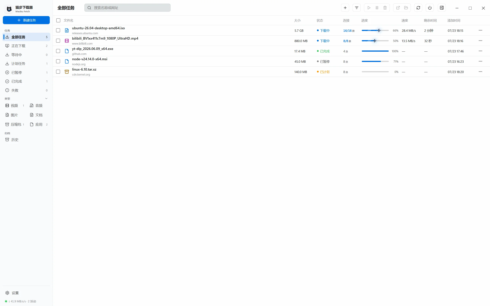
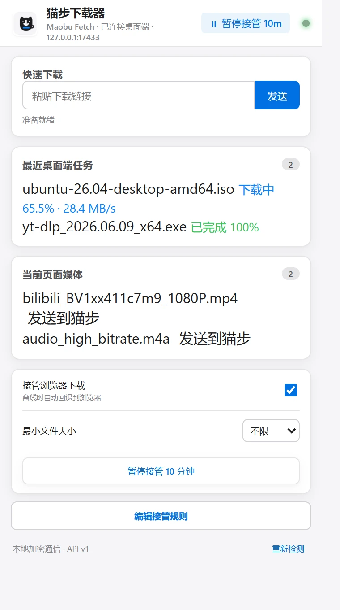
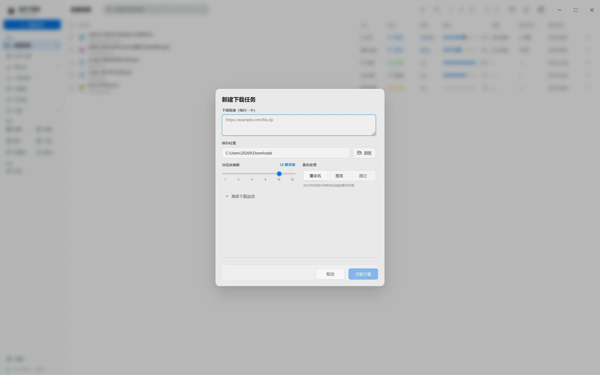
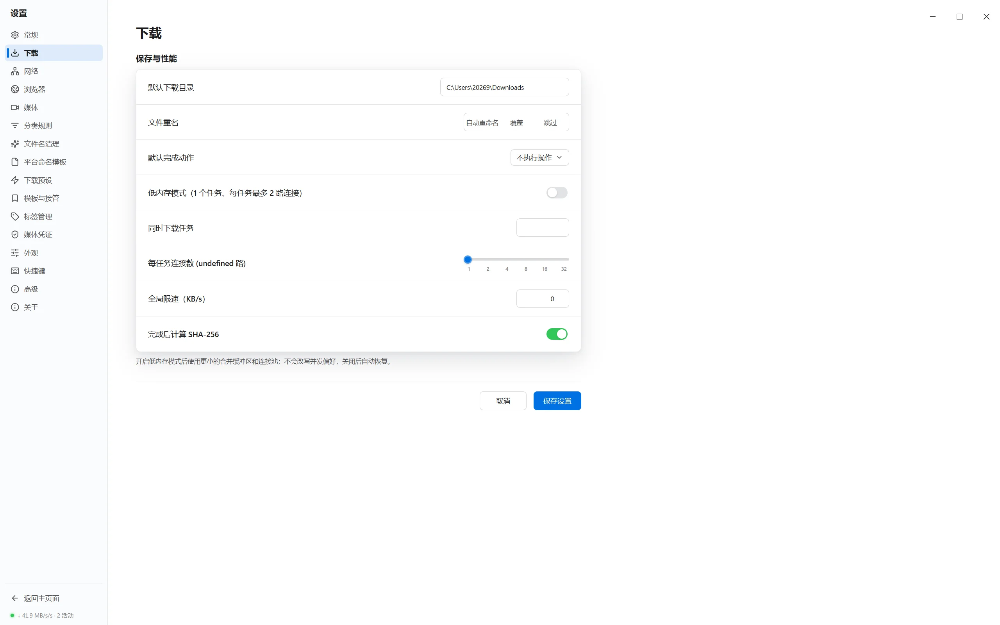
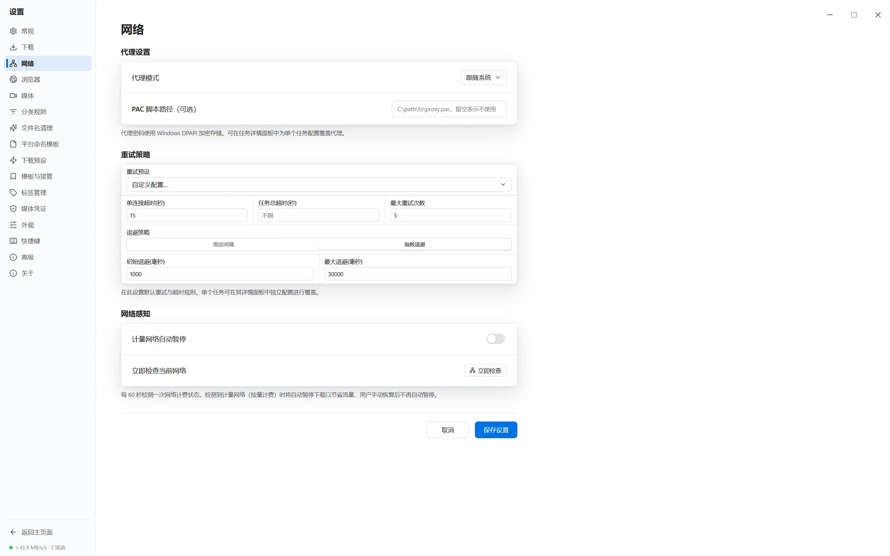
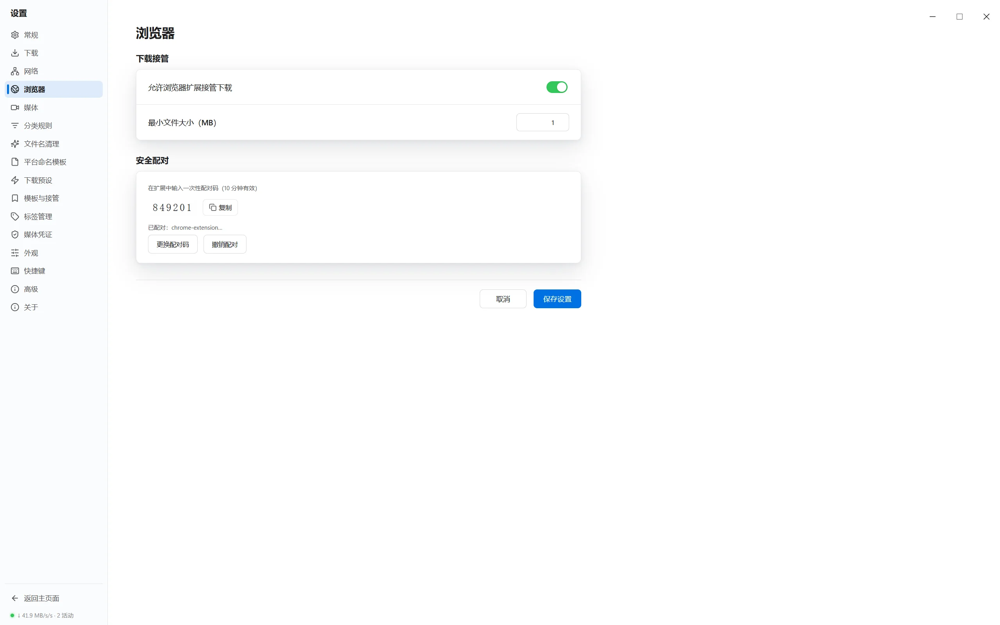
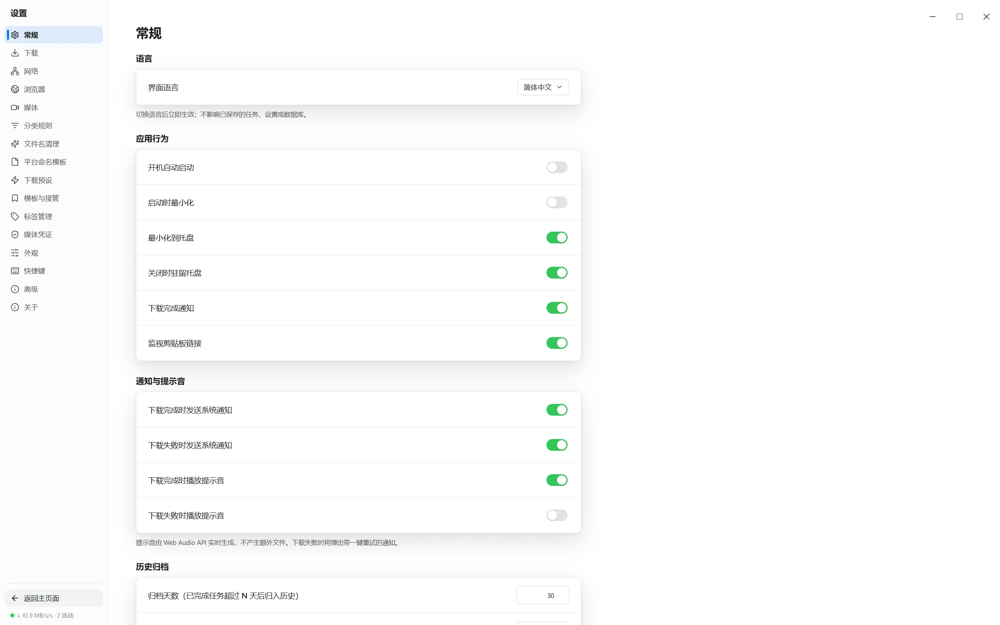
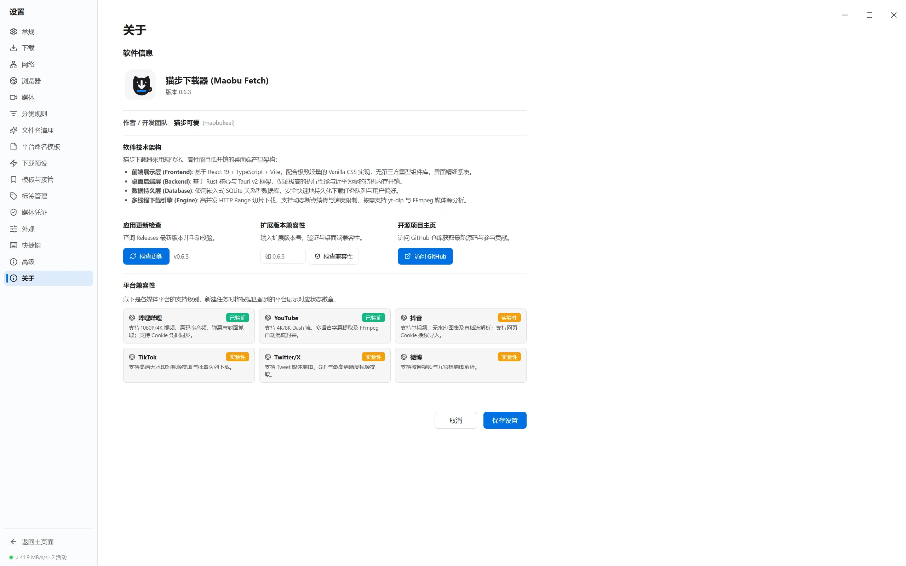

<div align="center">

# 🐱 猫步下载器 (Maobu Fetch)

<p align="center">
  <b>专为 Windows 10/11 设计的本地优先、高效紧凑型多线程下载管理器</b>
</p>

[](https://github.com/maobukeai/maobu-fetch/releases/tag/v0.6.3)
[](https://tauri.app)
[](https://react.dev)
[](https://www.rust-lang.org)
[](LICENSE)

[功能特性](#-功能特性) • [界面展示](#-界面展示) • [功能详解](#-功能详解) • [开发与构建指南](#-开发与构建指南) • [更新日志](CHANGELOG.md)

</div>

---

## 📖 项目简介

**猫步下载器（Maobu Fetch）** 是一款遵循 **本地优先（Local-First）** 理念打造的高性能下载客户端。它结合了 Rust 语言的高并发网络内核与现代前端响应式 UI，旨在为 Windows 用户提供轻量、极速、无广告、无痕追踪的专业下载体验。

不同于传统云端下载工具，猫步下载器没有任何在线用户系统、云端转发或遥测追踪，所有数据与文件均保留在您的本地设备上。

> [!NOTE]
> **强约束承诺**：零广告、零遥测、零在线登录、零后台无用请求。基础安装包小于 30MB，开箱即用。

---

## 🔥 功能特性

- ⚡ **HTTP Range 并发切片下载**：支持 `1 / 2 / 4 / 8 / 16 / 32` 多线程并发 Range 请求，无缝动态分片与原子合并，充分吃满带宽。
- 🛡️ **数据一致性校验**：续传自动校验 ETag 与 Last-Modified 标头，支持完成后自动 SHA-256 完整性哈希比对。
- 🌐 **本地安全桥与 MV3 扩展**：提供 Chrome & Edge 原生 Manifest V3 扩展，采用本地 `127.0.0.1` HMAC-SHA256 签名与一次性配对码机制安全接管下载。
- 🎬 **按需媒体增强内核**：解耦组件设计，提供 `yt-dlp` 与 `FFmpeg` 安全按需安装与版本校验，支持 Bilibili 1080P/4K、YouTube Dash 流视频智能抓取。
- 🎨 **Windows 11 效率型原生 UI**：融入 Win11 Acrylic 亚克力磨砂玻璃视效，184px 分类导航、40px 命令栏与全宽切片进度条，支持深浅色及高 DPI 自适应。
- ⚡ **智能断点续传与重试**：网络波动、系统休眠后自动挂起并安全续接，保护半成品分片不损坏。

---

## 🖼️ 界面展示

### 1. 软件主界面 dashboard

主界面由分类导航栏、顶部快捷命令栏、全宽任务表格及动态实时速度仪表盘组成。

<div align="center">
  
</div>

- **分类导航**：系统镜像、影视媒体、常用软件、压缩文件等智能自动归类与自定义分类规则。
- **状态统计**：实时显示全局总下载速度、当前并发任务数与活动连接总数。

---

### 2. 浏览器插件接管与安装 (Browser Extension)

猫步下载器配有专门针对 Chrome 和 Microsoft Edge 打造的 Manifest V3 官方扩展程序。扩展与本地客户端通过 `127.0.0.1:17433` 加密通信，实现网页下载链接自动接管与音视频媒体流抓取。

<div align="center">
  
</div>

#### 📦 插件安装与配置指南

1. **下载插件包**：
   前往 GitHub Releases 页面下载最新版本的 [`extension.zip`](https://github.com/maobukeai/maobu-fetch/releases/tag/v0.6.3) 并解压到本地文件夹。
2. **开启浏览器开发者模式**：
   - **Chrome**：在地址栏输入 `chrome://extensions/`，开启右上角的 **开发者模式**。
   - **Edge**：在地址栏输入 `edge://extensions/`，开启左侧的 **开发者模式**。
3. **加载插件**：
   点击 **加载已解压的扩展程序** (Load unpacked)，选择刚才解压的 `extension` 目录即可完成安装。
4. **安全配对授权**：
   打开猫步下载器桌面客户端 → 侧边栏“设置” → “浏览器接管”，复制 6 位动态配对码。点击浏览器插件图标，输入配对码完成 HMAC-SHA256 安全令牌绑定。

#### ✨ 插件核心功能

- ⚡ **无感拦截接管**：自动拦截浏览器默认下载，按文件类型、域名及设定的体积阈值（如 >1MB）精准接管。
- 🛡️ **离线安全回退**：若猫步桌面端未启动或退出，扩展会自动感知并回退为浏览器原生下载，绝不丢失用户的下载请求。
- 🔑 **登录态 Cookie 传递**：支持一键提取并向桌面端传递当前页面授权 Cookie（如 Bilibili 1080P/4K 登录凭据），无需手动输入或持久化落盘。
- 🎬 **网页媒体感知**：自动探测当前网页中的音视频媒体资源（M3U8 / MP4 / DASH），点击直通桌面端极速下载。

---

### 3. 线程切片与任务详情

选中任一下载任务，底部展开可视化分片进度条与全量 HTTP 协议标头元数据。

<div align="center">
  
</div>

- **切片可视化**：微观展示每个并发线程的起止偏移量（Range offset）、已下载字节数与单独线程下载速度。
- **元数据面板**：直观查看 ETag、Last-Modified、目标路径、SHA-256 校验状态及响应头。

---

### 4. 新建任务与高级预设

点击“新建任务”弹窗，可自定义 HTTP 请求头、Cookie、代理绕过策略及文件重命名逻辑。

<div align="center">
  
</div>

- **高级选项**：支持设置 Referer、Authorization、User-Agent、线程切片数 (`1-32`)。
- **重名策略**：自动重命名 (`rename`)、覆盖原文件 (`overwrite`) 或跳过 (`skip`)。

---

## ⚙️ 功能详解

系统设置分为 7 大核心模块，涵盖从存储路径到媒体解析的全方位配置：

### 1. 基础与存储设置 (General Settings)

控制文件默认保存目录、便携模式（Portable mode）状态以及磁盘缓存分析器。

<div align="center">
  
</div>

- **磁盘缓存清理**：实时检测 `.lumaget` 临时切片数据占用的空间，提供一键清理与校验功能。
- **便携模式**：支持将所有数据库与配置存放在程序同级目录，适合在 U 盘中使用。

---

### 2. 下载与并发限速 (Download Settings)

调控高并发下载引擎参数，保护磁盘寿命与带宽平衡。

<div align="center">
  
</div>

- **并发与切片上限**：设定全局最大并发任务数 (例如 `5`) 与单任务连接数 (最高 `32`)。
- **全局限速**：针对普通 HTTP 流与所有并发分片连接进行统一 Token Bucket 限速。

---

### 3. 网络代理与休眠规避 (Network Settings)

配置代理网络及局域网适配策略。

<div align="center">
  
</div>

- **代理支持**：支持跟随系统代理或指定 HTTP / SOCKS5 代理（含认证凭据）。
- **按流量计费网络保护**：在检测到移动热点或计费网络时自动暂停大文件下载。

---

### 4. 浏览器接管与安全配对 (Browser Bridge)

配置本地 HTTP Bridge 与 Chrome/Edge 扩展的加密授权。

<div align="center">
  
</div>

- **安全配对**：基于 `127.0.0.1:17433` 监听，配合 6 位一次性配对码与持久 HMAC-SHA256 令牌认证，杜绝未授权本地恶意软件调用。
- **接管阈值**：可设置接管文件大小下限（如仅接管 > 1MB 的文件）及域名白名单/黑名单。

---

### 5. 媒体增强与组件管理 (Media Tools)

按需解耦管理音视频解析组件，保证基础客户端轻量无臃肿。

<div align="center">
  
</div>

- **按需安装**：一键安装固定签名可信来源的 `yt-dlp` (2026.06.09) 与 `FFmpeg` (8.1.2)，存放于应用数据目录。
- **自动混流与提取**：支持视频音频分离下载后由 FFmpeg 无损封装为标准 MP4/MKV。

---

### 6. 外观与 Win11 亚克力风格 (Appearance Settings)

打造极致流畅的个性化视觉体验。

<div align="center">
  
</div>

- **系统主题同步**：支持浅色 (Light)、深色 (Dark) 及自动跟随 Windows 11 主题切换。
- **亚克力磨砂玻璃**：开启 Windows 11 DWM Acrylic / Mica 窗口背景材质。

---

### 7. 关于与平台兼容矩阵 (About & Compatibility Matrix)

查看版本状态、授权许可及各主流音视频平台的解析兼容度。

<div align="center">
  
</div>

- **平台兼容矩阵**：实时呈现 Bilibili (4K/高码率)、YouTube (Dash)、Douyin、TikTok、Twitter/X、Weibo 等站点的解析支持级别。

---

## 🛠️ 开发与构建指南

### 前置要求

- **操作系统**：Windows 10 / 11 (x64)
- **Node.js**：`v20.0.0` 或更高版本
- **pnpm**：`v9.0.0` 或更高版本
- **Rust**：`1.80.0` 或更高版本 (`x86_64-pc-windows-msvc` target)
- **C++ 构建工具**：Windows 10/11 SDK（包含 `rc.exe`）

### 本地开发运行

```powershell
# 1. 克隆代码库
git clone https://github.com/maobukeai/maobu-fetch.git
cd maobu-fetch

# 2. 安装前端依赖
pnpm install

# 3. 启动前端开发服务器与 Tauri 桌面端
pnpm tauri dev
```

### 自动化测试校验

在提交代码前，请确保通过所有自动化测试断言：

```powershell
# 前端类型检查
npx pnpm run check

# Rust 下载内核与 SQLite 迁移单元测试 (1050+ 测试套件)
cargo test --manifest-path src-tauri\Cargo.toml

# 浏览器扩展模拟 API 构建测试 (50+ 测试套件)
npx pnpm run extension:build
```

### 发布构建打包

```powershell
# 编译前端、浏览器扩展并构建 Windows NSIS 安装包及单文件发布包
npx tauri build
```

构建产物将保存在 `src-tauri/target/release/bundle/nsis/` 目录下。

---

## 📄 开源许可证

本项目采用 [MIT License](LICENSE) 许可证开源。

<div align="center">
  <sub>Made with ❤️ by <a href="https://github.com/maobukeai">maobukeai</a>. Designed for Windows 10/11.</sub>
</div>
